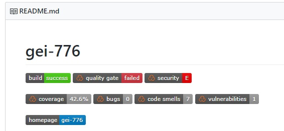

# Phase 2: Exigences (_Requirements_)

Cette section couvre la phase 2 du cadre de développement SDL, soit les exigences [[SDL2]](#sdl2).

## Pratique #2: Déterminer les exigences de sécurité et de confidentialité 
_SDL Practice #2: Establish Security and Privacy Requirements_

## Pratique #3: Établir des objectifs de qualité
_SDL Practice #3: Create Quality Gates/Bug Bars_

### Couverture de tests

Le seuil minimum pour la couverture de tests devra être de 80%.
Ce seuil minimum sera contrôlé à l'aide de JaCoCo, directement lors du build.
Dans la section `properties` du `pom.xml`, des variables ont été définies pour contrôller les objectifs de qualité.

```
        <quality-gate.coverage-ratio.line>0.80</quality-gate.coverage-ratio.line>
        <quality-gate.coverage-ratio.instruction>0.70</quality-gate.coverage-ratio.instruction>
        <quality-gate.dependencies.min-cvss-score>6</quality-gate.dependencies.min-cvss-score>
```

Les objectifs de qualité sont donc:
* 80% de couverture de tests pour les lignes de code
* 70% de couverture de tests pour les insructions
* Niveau 6 minimum pour le score calculé par la librairie [OWASP dependency check](https://www.owasp.org/index.php/OWASP_Dependency_Check) 

De la même manière, si Sonar détecte une faille de sécurité, il sera possible de le voir directement sur le `README.md`du projet.




Voir: 
* https://msdn.microsoft.com/en-us/library/cc307404.aspx
* https://msdn.microsoft.com/en-us/library/cc307403.aspx

Quality Gates (à revoir):
* Code Coverage: 80%
* Utiliser: https://www.owasp.org/index.php/OWASP_Dependency_Check
* Utiliser: http://find-sec-bugs.github.io/
* Utiliser: http://findbugs.sourceforge.net/
* Utiliser: http://checkstyle.sourceforge.net/
* Utiliser: https://pmd.github.io/

## Pratique #4: Évaluer les risques en matière de sécurité et de confidentialité
_SDL Practice #4: Perform Security and Privacy Risk Assessments_


<br/>

###### Références
|||
|---| ---|
|[SDL2] | <a name="sdl2"></a>[Security Development Lifecycle, Phase 2: Requirements](https://www.microsoft.com/en-us/SDL/process/requirements.aspx), Microsoft|
