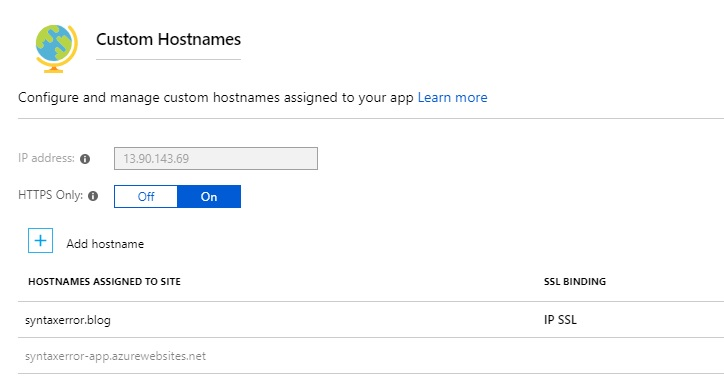
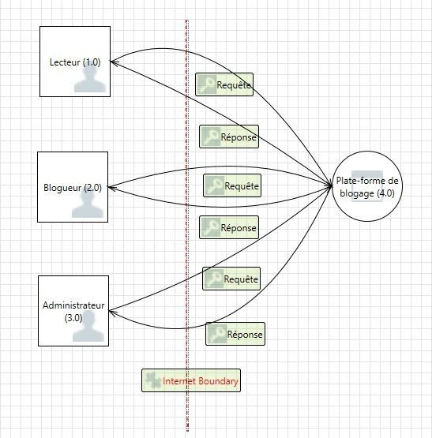
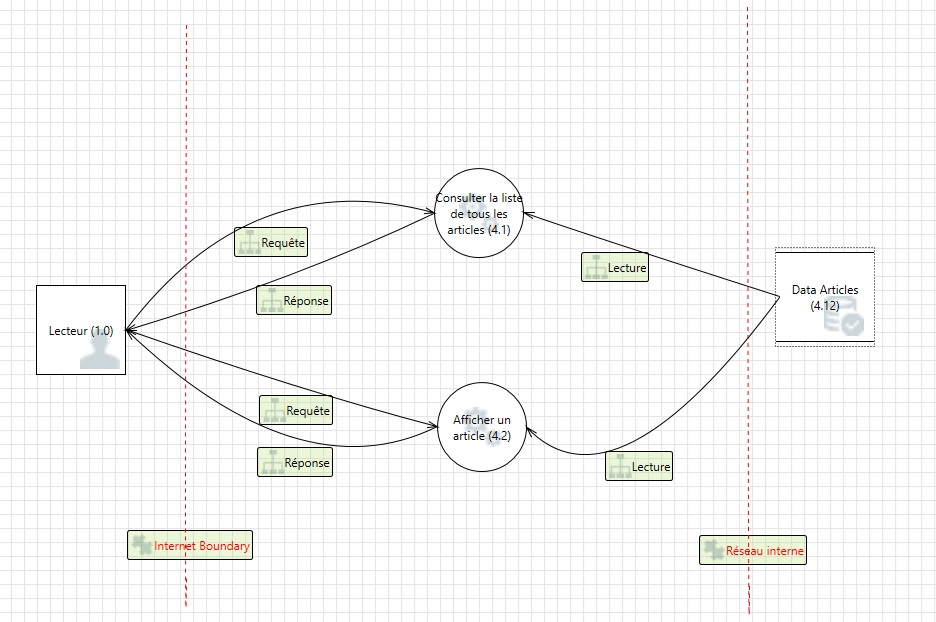
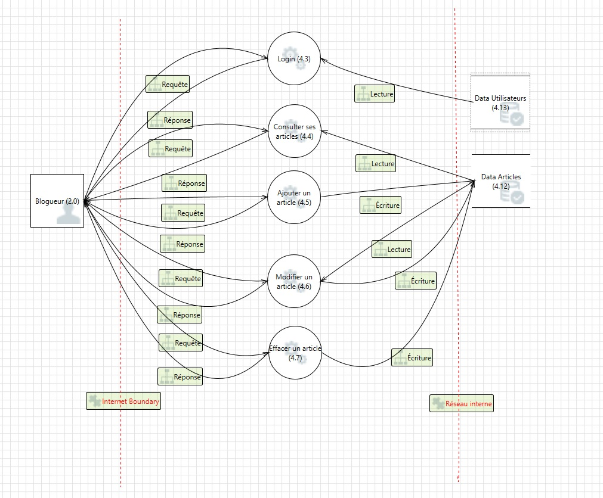
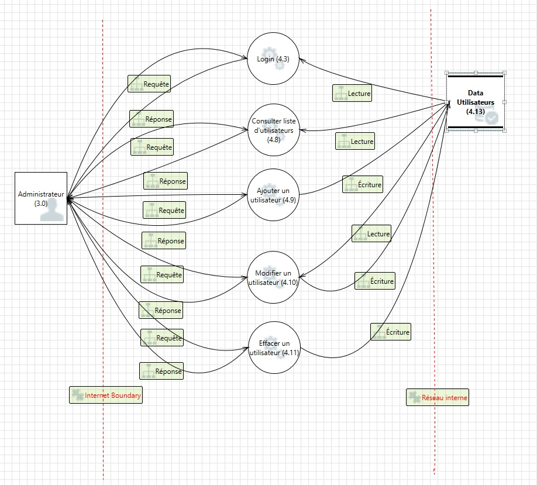

# Phase 3: Conception (_Design_)

Cette section couvre la phase 3 du cadre de développement SDL, soit la conception [[SDL3]](#sdl3).

## Pratique #5: Déterminer les exigences de conception 
_SDL Practice #5: Establish Design Requirements_

### Architecture de l'application à haut hiveau

L'application sera constituer des composants suivants:
* Serveur HTTP (Apache)
* Application Java (application Spring Boot JAR exécutable)
* Base de données (PostgreSQL) 

### Hachage de mot de passe

Microsoft ne fait pas de recommendation quant au hachage de mot de passe [[MSCR]](#mscr).
L'OWASP suggère d'utiliser une fonction de hachage à sens unique [[PSCS]](#pscs).
Ils proposent les algorithmes suivants:

* Argon2, algorithme qui a remporté la compétition de _Password Hashing_ ([password hashing competition](https://password-hashing.net/)).
* PBKDF2
* scrypt
* bcrypt

Il n'y a pas d'implémentation fiable de Argon2 disponible en Java. 
OWASP suggére de n'utiliser bcrypt que si PBKDF2 ou scrypt ne sont pas disponibles.
Des implémentations de PBKDF2, scrypt et bcrypt sont disponibles dans _Spring Security_.
Nous utiliserons malgré tout bcrypt pour sa simplicité. 
La taille du hachage en base de données sera de 60 charactères. 

TODO: Autres concerns [[OT10]](#ot10)
* Le blogueur pourra choisir le nom qu'il veut afficher aux utilisateurs
* Régles pour mot de passe? (nombre de charactères minimum? Chiffres? Lettres? Majuscules? Caractères spéciaux?)
* Injection SQL?
* Sécurité de l'authentification?
* Accès à des sections réservées? (Authorisation)
* Script intersites (_Cross-site scripting_)?
* Autres menaces?

## Pratique #6: Analyse et réducation de la surface d'attaque
_SDL Practice #6: Perform Attack Surface Analysis/Reduction_

### Analyse de la surface d'attaque
_Attack Surface Analysis (ASA)_

* L'application peut écouter sur les ports 80 et 443
* L'application Spring Boot devra répondre aux requêtes HTTP
* Des resources statiques (images) devront être disponibles
* Une base de données s'occupera de stocker l'information 
* La base de données devra être accessible pour la maintenance et l'administration

### Réduction de la surface d'attaque
_Attack Surface Reduction (ASR)_

* L'application sera accessible de l'externe
* Le serveur HTTP devra rediriger le traffic HTTP vers HTTPS
* Seuls les ports 80 et 443 seront disponibles de l'externe
* La base données sera accessible à l'application Java Spring Boot, mais pas du serveur HTTP
* Seul le port de PostgreSQL sera accessible à l'application Java Spring Boot (typiquement 5432)
* TODO: Gestion de la BD?
* L'utilisateur `root` ne sera pas utilisé pour exécuter les processus (application Java, PostgreSQL)

#### Installation d'un certificat SSL

Un fichier de format PFX a été créé à l'aide de Open SSL, en utilisant les fichiers suivants:
* La clé pour le domaine `syntaxerror.blog` fourni par Comodo
* Le certificat pour le domaine `syntaxerror.blog` fourni par Comodo
* Le certificat racine (Root certificate) et intermédiaires fournis par Comodo pour le certificat PositiveSSL [[COMO]](#como)
```
openssl pkcs12 -export -out syntaxerror.blog.pfx -inkey syntaxerror.blog.key -in syntaxerror.blog.crt -certfile comodorsadomainvalidationsecureserverca.crt -certfile comodorsaaddtrustca.crt -certfile addtrustexternalcaroot.crt
```

#### Imposer le traffic HTTPS

Le fichier PFX est importé sur Azure, et assigné à l'application dans la section "SSL Settings". Il est ensuite possible de demander de rediriger le traffic HTTP vers HTTPS dans l'écran de configuration "Custom domains".



## Pratique #7: Modélisation de la menace
_SDL Practice #7: Use Threat Modeling_

La modélisation de la menace a été effectué à l'aide de l'outil [Microsoft Threat Modeling Tool 2016](https://www.microsoft.com/en-us/download/details.aspx?id=49168).

### Diagramme de flux de données

#### DFD niveau 0



#### DFD niveau 1: Perspective du lecteur



#### DFD niveau 1: Perspective du blogueur



#### DFD niveau 1: Perspective de l'administrateur



### Identification des menaces

#### Énumération brute des éléments du DFD

| Type d’éléments du DFD | Numéro de l’item du DFD |
|---| ---|
| Entités externes | Lecteur (1.0) <br/> Blogueur (2.0) <br/> Administrateur (3.0) |
| Processus | Consulter Liste d'articles (4.1) <br/> Afficher article (4.2) <br/> Login (4.3) <br/> Consulter ses articles (4.4) <br/> Ajouter un article (4.5) <br/> Modifier un article (4.6) <br/> Effacer un article (4.7) <br/> Consulter liste d'utilisateurs (4.8) <br/> Ajouter utilisateur (4.9) <br/> Modifier utilisateur (4.10) <br/> Effacter utilisateur (4.11)|
| Dépôts de données | Données articles (4.12) <br/> Données utilisateurs (4.13) |
| Flux de données | Requête liste articles (1.0 -> 4.1) <br/> Réponse liste articles (4.1 -> 1.0) <br/> Lister articles (4.12 -> 4.1) <br/> Requête afficher article (1.0 -> 4.2) <br/> Réponse afficher article (4.2 -> 1.0) <br/> Afficher article (4.12 -> 4.2) <br/> Requête login blogueur (2.0 -> 4.3) <br/> Réponse login blogueur (4.3 -> 2.0) <br/> Login (4.13 -> 4.3) <br/> Requête consulter ses articles (2.0 -> 4.4) <br/> Réponse consulter ses articles (4.4 -> 2.0) <br/> Consulter ses articles (4.12 -> 4.4) <br/> Requête ajouter un article (2.0 -> 4.5) <br/> Réponse ajouter un article (4.5 -> 2.0) <br/> Ajouter un article (4.5 -> 4.12) <br/> Requête modifier un article (2.0 -> 4.6) <br/> Réponse modifier un article (4.6 -> 2.0) <br/> Obtenir article à modifier (4.12 -> 4.6) <br/> Mettre à jour article (4.6 -> 4.12) <br/> Requête effacer un article (2.0 -> 4.7) <br/> Réponse effacer un article (4.7 -> 2.0) <br/> Détruire article (4.7 -> 4.12) <br/> Requête login administrateur (3.0 -> 4.3) <br/> Réponse login administrateur (4.3 -> 3.0) <br/> Requête consulter la liste des utilisateurs (3.0 -> 4.8) <br/> Réponse consulter la liste des utilisateurs (4.8 -> 3.0) <br/> Consulter la liste des utilisateurs (4.13 -> 4.8) <br/> Requête ajouter un utilisateur (3.0 -> 4.9) <br/> Réponse ajouter un utilisateur (4.9 -> 3.0) <br/> Ajouter un utilisateur (4.9 -> 4.13) <br/> Requête modifier un utilisateur (3.0 -> 4.10) <br/> Réponse modifier un utilisateur (4.10 -> 3.0) <br/> Obtenir utilisateur à modifier (4.13 -> 4.10) <br/> Mettre à jour utilisateur (4.10 -> 4.13) <br/> Requête effacer un utilisateur (3.0 -> 4.11) <br/> Réponse effacer un utilisateur (4.11 -> 3.0) <br/> Détruire utilisateur (4.11 -> 4.13) |

#### Énumération réduite des éléments du DFD

| Type d’éléments du DFD | Numéro de l’item du DFD |
|---| ---|
| Entités externes | Lecteur (1.0) <br/> Blogueur (2.0) <br/> Administrateur (3.0) |
| Processus | Consulter articles (4.1, 4.2) <br/> Login (4.3) <br/> CRUD Articles (4.4, 4.5, 4.6, 4.7) <br/> CRUD utilisateurs (4.8, 4.9, 4.10, 4.11)|
| Dépôts de données | Données articles (4.12) <br/> Données utilisateurs (4.13) |
| Flux de données | Requête liste articles (1.0 -> 4.1 -> 1.0) <br/> Lister articles (4.12 -> 4.1) <br/> Requête afficher article (1.0 -> 4.2 -> 1.0) <br/> Afficher article (4.12 -> 4.2) <br/> Requête login blogueur (2.0 -> 4.3 -> 2.0) <br/> Login (4.13 -> 4.3) <br/> Requête consulter ses articles (2.0 -> 4.4 -> 2.0) <br/> Consulter ses articles (4.12 -> 4.4) <br/> Requête ajouter un article (2.0 -> 4.5 -> 2.0) <br/> Ajouter un article (4.5 -> 4.12) <br/> Requête modifier un article (2.0 -> 4.6 -> 2.0) <br/> Modifier article (4.12 -> 4.6 -> 4.12) <br/> Requête effacer un article (2.0 -> 4.7 -> 2.0) <br/> Détruire article (4.7 -> 4.12) <br/> Requête login administrateur (3.0 -> 4.3 -> 3.0) <br/> Requête consulter la liste des utilisateurs (3.0 -> 4.8 -> 3.0) <br/> Consulter la liste des utilisateurs (4.13 -> 4.8) <br/> Requête ajouter un utilisateur (3.0 -> 4.9 -> 3.0) <br/> Ajouter un utilisateur (4.9 -> 4.13) <br/> Requête modifier un utilisateur (3.0 -> 4.10 -> 3.0) <br/> Modifier un utilisateur (4.13 -> 4.10 -> 4.13) <br/> Requête effacer un utilisateur (3.0 -> 4.11 -> 3.0) <br/> Détruire utilisateur (4.11 -> 4.13) |

#### Menaces au système

Le modèle STRIDE va nous permettre de déterminer plus précisément quels sont les menaces au système. L'acronyme STRIDE signifit:
* _Spoofing_ (mystification)
* _Tampering_ (altération)
* _Repudiation_ (répudiation)
* _Information Disclosure_ (divulgation d'informations)
* _Denial of Service_ (déni de service)
* _Elevation of Privilege_ (élévation de privilège)

On peut établir les correspondantes suivantes aux menaces du modèle STRIDE:

| Type d’éléments du DFD | S | T | R | I | D | E |
|---|---|---|---|---|---|---|
| Entités externes  | X |   | X |   |   |   |
| Processus         |   | X |   | X | X |   |
| Dépôts de données |   | X | + | X | X |   |
| Flux de données   | X | X | X | X | X | X |

_+ Note: les dépôts de données affectés par la répudiation sont les logs d'audit. Étant donné la taille du projet, je n'en prendrais pas compte._

Finalement, on en déduit les ménaces au système à partir de l'énumération réduite des éléments du DFD.

| Type de menace STRIDE | Numéros des items du DFD impliqués |
|---| ---|
| _Spoofing_ | Entités externes: (1.0), (2.0), (3.0) <br/> Processus: (4.1, 4.2), (4.3), (4.4, 4.5, 4.6, 4.7), (4.8, 4.9, 4.10, 4.11) |
| _Tampering_ | Processus: (4.1, 4.2), (4.3), (4.4, 4.5, 4.6, 4.7), (4.8, 4.9, 4.10, 4.11) <br/> Dépôts de données: (4.12), (4.13) <br/> Flux de données: (1.0 -> 4.1 -> 1.0), (4.12 -> 4.1), (1.0 -> 4.2 -> 1.0), (4.12 -> 4.2), (2.0 -> 4.3 -> 2.0), (4.13 -> 4.3), (2.0 -> 4.4 -> 2.0), (4.12 -> 4.4), (2.0 -> 4.5 -> 2.0), (4.5 -> 4.12), (2.0 -> 4.6 -> 2.0), (4.12 -> 4.6 -> 4.12), (2.0 -> 4.7 -> 2.0), (4.7 -> 4.12), (3.0 -> 4.3 -> 3.0), (3.0 -> 4.8 -> 3.0), (4.13 -> 4.8), (3.0 -> 4.9 -> 3.0), (4.9 -> 4.13), (3.0 -> 4.10 -> 3.0), (4.13 -> 4.10 -> 4.13), (3.0 -> 4.11 -> 3.0), (4.11 -> 4.13) |
| _Repudiation_ | Entités externes: (1.0), (2.0), (3.0) |
| _Information Disclosure_ | Processus: (4.1, 4.2), (4.3), (4.4, 4.5, 4.6, 4.7), (4.8, 4.9, 4.10, 4.11) <br/> Dépôts de données: (4.12), (4.13) <br/> Flux de données: (1.0 -> 4.1 -> 1.0), (4.12 -> 4.1), (1.0 -> 4.2 -> 1.0), (4.12 -> 4.2), (2.0 -> 4.3 -> 2.0), (4.13 -> 4.3), (2.0 -> 4.4 -> 2.0), (4.12 -> 4.4), (2.0 -> 4.5 -> 2.0), (4.5 -> 4.12), (2.0 -> 4.6 -> 2.0), (4.12 -> 4.6 -> 4.12), (2.0 -> 4.7 -> 2.0), (4.7 -> 4.12), (3.0 -> 4.3 -> 3.0), (3.0 -> 4.8 -> 3.0), (4.13 -> 4.8), (3.0 -> 4.9 -> 3.0), (4.9 -> 4.13), (3.0 -> 4.10 -> 3.0), (4.13 -> 4.10 -> 4.13), (3.0 -> 4.11 -> 3.0), (4.11 -> 4.13) |
| _Denial of Service_ | Processus: (4.1, 4.2), (4.3), (4.4, 4.5, 4.6, 4.7), (4.8, 4.9, 4.10, 4.11) <br/> Dépôts de données: (4.12), (4.13) <br/> Flux de données: (1.0 -> 4.1 -> 1.0), (4.12 -> 4.1), (1.0 -> 4.2 -> 1.0), (4.12 -> 4.2), (2.0 -> 4.3 -> 2.0), (4.13 -> 4.3), (2.0 -> 4.4 -> 2.0), (4.12 -> 4.4), (2.0 -> 4.5 -> 2.0), (4.5 -> 4.12), (2.0 -> 4.6 -> 2.0), (4.12 -> 4.6 -> 4.12), (2.0 -> 4.7 -> 2.0), (4.7 -> 4.12), (3.0 -> 4.3 -> 3.0), (3.0 -> 4.8 -> 3.0), (4.13 -> 4.8), (3.0 -> 4.9 -> 3.0), (4.9 -> 4.13), (3.0 -> 4.10 -> 3.0), (4.13 -> 4.10 -> 4.13), (3.0 -> 4.11 -> 3.0), (4.11 -> 4.13) |
| _Elevation of Privilege_ | Processus: (4.1, 4.2), (4.3), (4.4, 4.5, 4.6, 4.7), (4.8, 4.9, 4.10, 4.11) |


### Déterminer le risque

...

### Plan d'atténuation

<br/>

###### Références
|||
|---| ---|
|[COMO] | <a name="como"></a>[Comodo Knoledge Base: Which is Root? Which is Intermediate?](https://support.comodo.com/index.php?/Knowledgebase/Article/View/620/0/which-is-root-which-is-intermediate), Comodo |
|[OT10] | <a name="ot10"></a>[OWASP Top 10 - 2017](https://www.owasp.org/images/7/72/OWASP_Top_10-2017_%28en%29.pdf.pdf), OWASP|
|[MSCR] | <a name="mscr"></a>[Microsoft SDL Cryptographic Recommendations](http://download.microsoft.com/download/6/3/A/63AFA3DF-BB84-4B38-8704-B27605B99DA7/Microsoft%20SDL%20Cryptographic%20Recommendations.pdf), Microsoft|
|[PSCS] | <a name="pscs"></a>[Password Storage Cheat Sheet](https://www.owasp.org/index.php/Password_Storage_Cheat_Sheet), OWASP|
|[SDL3] | <a name="sdl3"></a>[Security Development Lifecycle, Phase 3: Design](https://www.microsoft.com/en-us/SDL/process/design.aspx), Microsoft|
